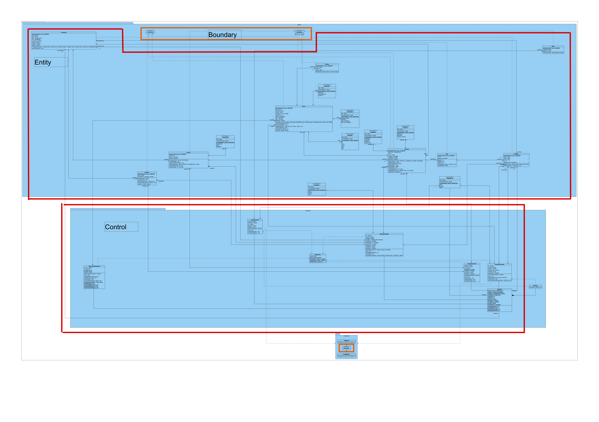

# SC2002 Object-Oriented Design & Programming Project 2022 (Y2S1)
## Movie Booking And Listing Management Application (MOBLIMA)
MOBLIMA is an application to computerize the processes of making online booking and purchase of movie tickets, listing of movies and sale reporting. It will be used by the movie-goers and cinema staff.

## Unified Modelling Language (UML) Diagram

## Assumptions
* This is a single-user application and there is no need to consider concurrent access
